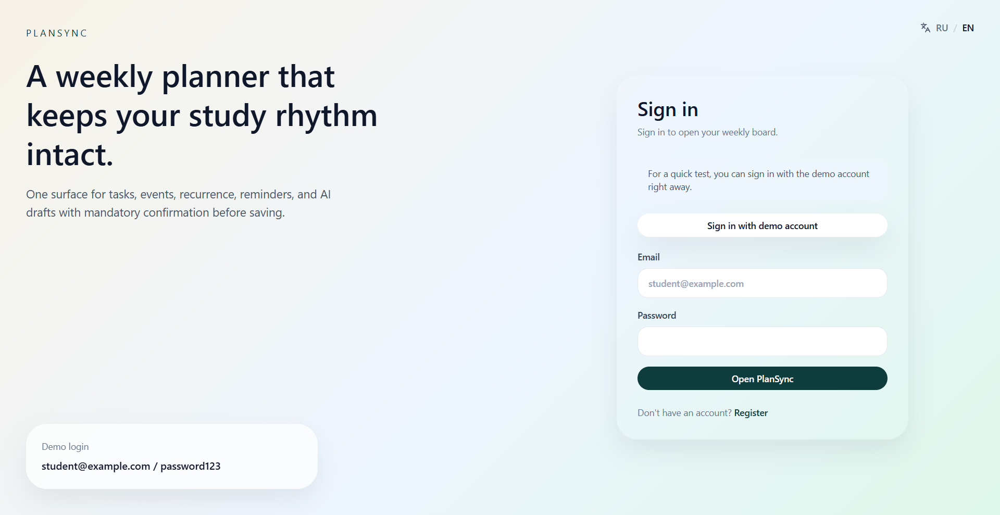
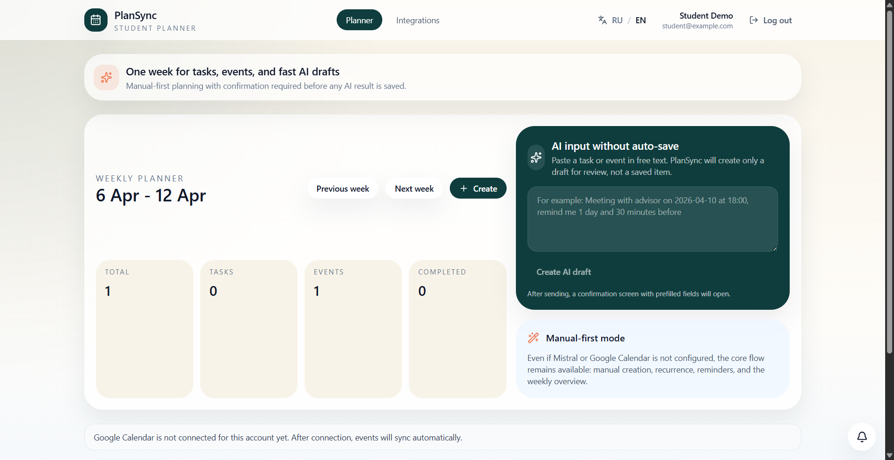
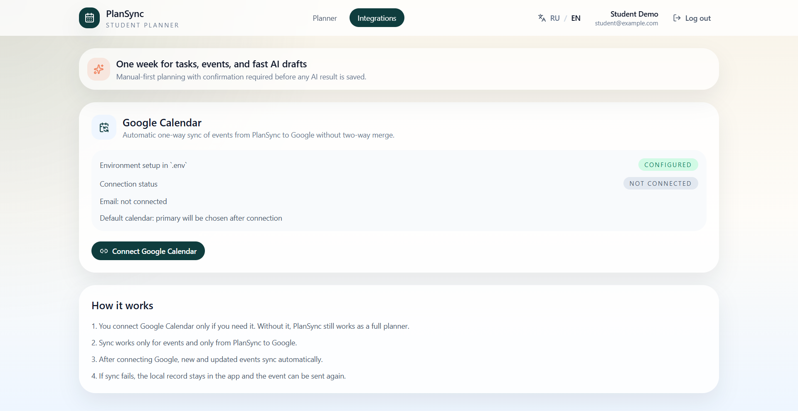
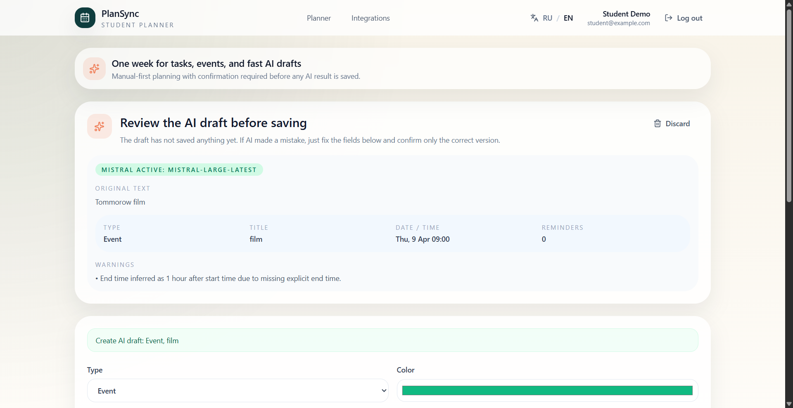

# PlanSync

Full-stack study planner that combines tasks, events, reminders, recurring routines, AI-assisted input, and a weekly overview in one place.

## Demo

Current product visual:







Recommended extra screenshot for final submission:

- planner dashboard with the weekly view and item cards

## Product Context

### End Users

- students who manage lectures, deadlines, study sessions, and routines
- young professionals who want a simple weekly planning tool
- users who like fast free-text input but still want control before saving AI output

### Problem That The Product Solves

Students often split their planning across several tools:

- deadlines are stored in one app
- events are stored in another
- reminders are easy to miss
- writing plans in natural language is fast, but structuring them manually takes time

This creates friction, missed deadlines, and a fragmented view of the week.

### Your Solution

PlanSync gives the user one planning surface for tasks and events, supports recurring routines and reminders, and adds AI-assisted parsing to reduce manual input. AI never auto-saves anything: the user always reviews and confirms the extracted data before it becomes a planner item.

## Features

### Implemented Features

- registration and login
- multi-user planner with per-user data isolation
- manual create, edit, and delete for tasks and events
- recurring items: daily, weekly, monthly
- multiple reminders per item
- weekly planner view
- completion tracking for recurring and non-recurring tasks
- AI-assisted parsing through Mistral
- confirmation flow before saving AI-parsed data
- optional Google Calendar connection and event sync
- Docker Compose deployment
- Alembic migrations

### Not Yet Implemented Features

- Telegram bot integration
- production-ready HTTPS and reverse-proxy setup inside the repo
- automated CI/CD deployment flow
- analytics and usage tracking
- mobile app or PWA packaging

## Usage

### 1. Sign In Or Register

- open the website
- create an account or log in with an existing one

### 2. Plan Your Week Manually

- open the planner page
- create a task or event
- set the date, time, reminders, and recurrence if needed

### 3. Use AI To Save Time

- open the AI parse panel
- write your plan in natural language
- review the generated draft
- edit fields if needed
- confirm the draft to save it

### 4. Manage Reminders

- add one or more reminders to a task or event
- use browser or in-app reminder channels where supported

### 5. Connect Google Calendar

- open the integrations page
- connect your Google account
- sync planner events to Google Calendar

## Deployment

### Target VM OS

Use Ubuntu 24.04 LTS.

### What Should Be Installed On The VM

- `git`
- `docker`
- `docker compose` plugin

Install them with:

```bash
sudo apt update
sudo apt install -y git docker.io docker-compose-plugin
sudo systemctl enable docker
sudo systemctl start docker
```

Optional, to run Docker without `sudo`:

```bash
sudo usermod -aG docker $USER
newgrp docker
```

### Step-By-Step Deployment Instructions

#### 1. Clone The Repository

```bash
git clone https://github.com/kkonstantin08/se-toolkit-hackathon.git
cd se-toolkit-hackathon
```

#### 2. Create The Environment File

```bash
cp .env.example .env
nano .env
```

Minimum required values:

```env
POSTGRES_DB=plansync
POSTGRES_USER=plansync
POSTGRES_PASSWORD=strong_password_here
DATABASE_URL=postgresql+psycopg://plansync:strong_password_here@db:5432/plansync

APP_ENV=production
APP_HOST=0.0.0.0
APP_PORT=8000
SECRET_KEY=put_a_long_random_secret_here
ACCESS_TOKEN_EXPIRE_MINUTES=15
REFRESH_TOKEN_EXPIRE_DAYS=7
COOKIE_SECURE=false
BACKEND_CORS_ORIGINS=http://<VM_IP>:8080
FRONTEND_URL=http://<VM_IP>:8080
API_BASE_URL=/api/v1
```

If you want AI parsing:

```env
MISTRAL_API_KEY=your_mistral_api_key
MISTRAL_MODEL=mistral-large-latest
```

If you want Google Calendar integration:

```env
GOOGLE_CLIENT_ID=your_google_client_id
GOOGLE_CLIENT_SECRET=your_google_client_secret
GOOGLE_REDIRECT_URI=http://<VM_IP>:8000/api/v1/integrations/google/callback
GOOGLE_CALENDAR_SCOPES=https://www.googleapis.com/auth/calendar.events https://www.googleapis.com/auth/userinfo.email
```

#### 3. Build And Start The Project

```bash
docker compose up -d --build
```

#### 4. Check That Containers Are Running

```bash
docker compose ps
docker compose logs -f backend
```

#### 5. Open The Application

- frontend: `http://<VM_IP>:8080`
- backend: `http://<VM_IP>:8000`
- API docs: `http://<VM_IP>:8000/docs`
